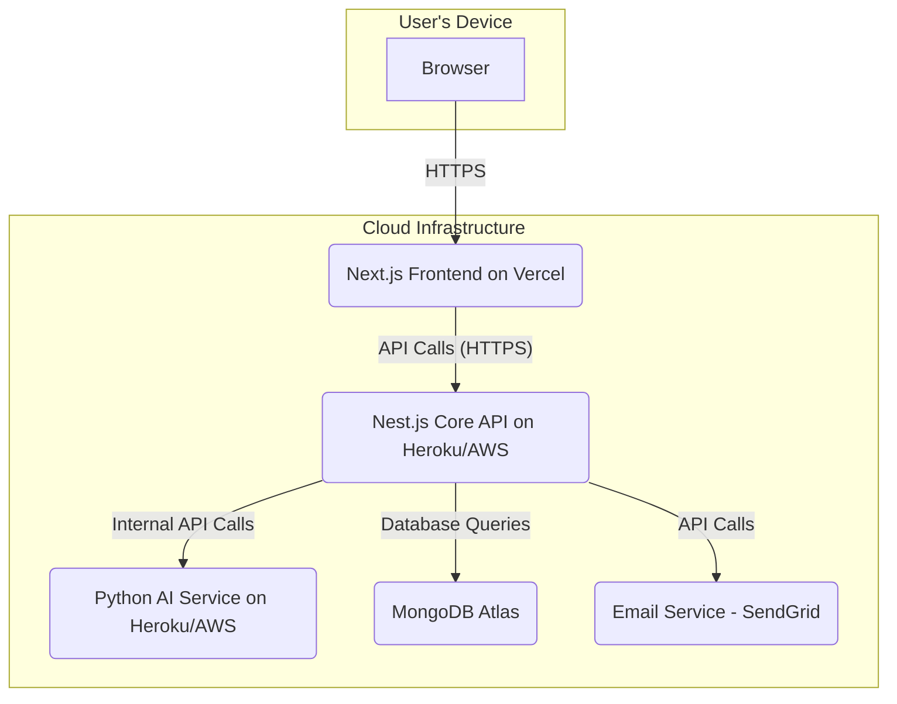

# System Design Document for [Your Tech Agency Name] Website

## 1. Introduction

This document provides a detailed technical design for the web application outlined in the Software Requirement Specification (SRS). It covers the system architecture, database design, API endpoints, and frontend structure.

## 2. System Architecture (Updated)

The application will follow a **Microservice Architecture**. This approach breaks down the application into smaller, independent services that communicate with each other, typically over APIs. This enhances scalability, maintainability, and allows for technology flexibility for each service.

- **Client (Frontend):** A Next.js single-page application (SPA). It remains the primary user interface.
- **Core Backend Service:** A **Nest.js** application that serves as the main API. It handles core business logic, user authentication, content management, and is the primary interface for the frontend.
- **AI Service:** A **Python** microservice (using a framework like FastAPI or Flask) dedicated to handling all AI-related tasks, such as the logic for the chatbot.
- **Database:** A MongoDB database, primarily accessed by the Core Backend Service.

### 2.1 Architecture Diagram

## 3. Database Design

We will use a NoSQL database (MongoDB). The data will be organized into collections.

### 3.1 `users` Collection
Stores credentials for internal staff.

- `_id`: ObjectId (Primary Key)
- `name`: String
- `email`: String (Unique, Indexed)
- `password`: String (Hashed)
- `role`: String (Enum: 'Admin', 'Editor', 'Sales')
- `createdAt`: Timestamp
- `updatedAt`: Timestamp

### 3.2 `blogPosts` Collection
Stores blog articles.

- `_id`: ObjectId
- `title`: String
- `slug`: String (Unique, Indexed)
- `content`: String (Markdown or HTML)
- `author`: ObjectId (ref: 'users')
- `status`: String (Enum: 'Draft', 'Published')
- `tags`: [String]
- `featuredImage`: String (URL)
- `createdAt`: Timestamp
- `updatedAt`: Timestamp

### 3.3 `leads` Collection
Stores information from contact forms, downloads, etc.

- `_id`: ObjectId
- `name`: String
- `email`: String (Indexed)
- `company`: String
- `source`: String (e.g., 'Contact Form', 'Ebook Download')
- `status`: String (Enum: 'New', 'Contacted', 'Qualified', 'Unqualified')
- `message`: String
- `createdAt`: Timestamp

### 3.4 `projects` Collection
Stores portfolio/case study information.

- `_id`: ObjectId
- `title`: String
- `slug`: String (Unique, Indexed)
- `description`: String
- `clientName`: String
- `services`: [String]
- `imageUrl`: String
- `projectUrl`: String (Optional)
- `published`: Boolean
- `createdAt`: Timestamp

## 4. API Design (RESTful)

The **Nest.js** backend will expose a REST API. All responses will be in JSON format. Nest.js's structure with controllers and services maps directly to this design.

**Base URL:** `/api/v1`

### 4.1 Authentication (`/auth`)
- `POST /auth/login`: Authenticate a user and return a JWT.
- `POST /auth/register`: Create a new user (Admin only).
- `GET /auth/me`: Get the currently logged-in user's profile.

### 4.2 Blog Posts (`/posts`)
- `GET /posts`: Get a list of all published posts (for public).
- `GET /posts/all`: Get all posts (for admin).
- `GET /posts/:slug`: Get a single post by its slug.
- `POST /posts`: Create a new post (Authenticated: Admin, Editor).
- `PUT /posts/:id`: Update a post (Authenticated: Admin, Editor).
- `DELETE /posts/:id`: Delete a post (Authenticated: Admin).

### 4.3 Leads (`/leads`)
- `GET /leads`: Get all leads (Authenticated: Admin, Sales).
- `POST /leads`: Create a new lead from a form submission (Public).
- `PUT /leads/:id`: Update a lead's status (Authenticated: Admin, Sales).

### 4.4 Projects (`/projects`)
- `GET /projects`: Get all published projects.
- `POST /projects`: Create a new project (Authenticated: Admin).
- `PUT /projects/:id`: Update a project (Authenticated: Admin).

## 5. Frontend Architecture

The frontend will be built with **React (Next.js)** and organized into a component-based structure.

- **`pages/`**: Corresponds to the routes of the application (e.g., `pages/blog/[slug].js`). Next.js uses this for file-system based routing.
- **`components/`**: Contains reusable UI components.
  - **`common/`**: Basic elements like `Button`, `Input`, `Card`.
  - **`layout/`**: `Navbar`, `Footer`, `Sidebar`.
  - **`feature-specific/`**: Components tied to a feature, like `BlogPostCard`, `ContactForm`.
- **`services/`**: Functions for making API calls to the backend.
- **`hooks/`**: Custom React hooks (e.g., `useAuth`).
- **`styles/`**: Global styles and CSS modules.
- **`public/`**: Static assets like images and fonts.

## 6. Deployment Strategy

- **Frontend (Next.js):** Deployed on **Vercel**. Vercel is optimized for Next.js and provides automatic builds, deployments, and a global CDN out-of-the-box.
- **Backend (Nest.js API):** Deployed on a PaaS like **Heroku** or **Render**.
- **AI Service (Python):** Deployed as a separate service on **Heroku**, **Render**, or a container service on AWS/GCP.
- **Database (MongoDB):** Hosted on **MongoDB Atlas**, a fully-managed cloud database service.
- **CI/CD:** A pipeline will be set up using **GitHub Actions**. On every push to the `main` branch, the pipeline will automatically run tests and deploy the frontend, backend, and AI services to their respective platforms.
